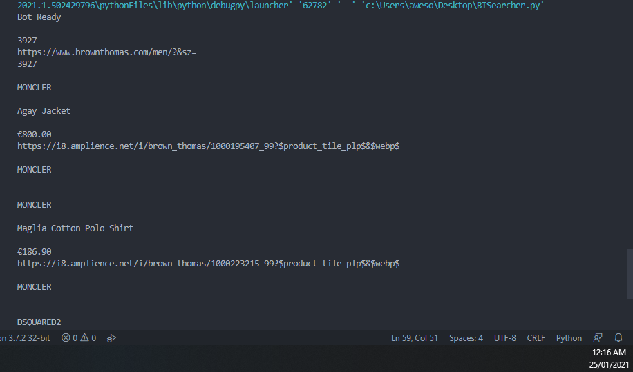

# Brown Thomas Web Scraper with Search/Filter using Discord WebHooks

This is me returning to my original project [Here](https://github.com/EddieSheehy/Brown-Thomas-Discord-Scraper) but adding the ability of filtering for a certain product or brand using the command '!lookup ITEM'.

## How to run
```bash
python3 BT.py
```

## Example of Console Output


## Example of Discord Webhook


